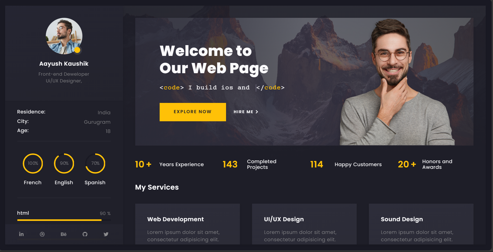

<h1 align="center">🌐 Portfolio Site</h1>

<p align="center">
  <b>My personal developer portfolio showcasing my projects, skills, and creative journey.</b><br/>
  <i>Crafted with love using React, Tailwind CSS, and Three.js</i>
</p>

<p align="center">
  
  
  
</p>

---

## 🔗 Live Site

👉 **[Visit My Portfolio](https://lakshaykaushik1.github.io/Portfolio-Site/)**  
_A fully responsive, interactive 3D developer showcase._

---

## ✨ Key Features

- 🚀 Smooth animations and transitions with Framer Motion
- 🎮 Interactive 3D models using Three.js / React Three Fiber
- 💡 Clean, responsive layout with Tailwind CSS
- 🌙 Light/Dark theme toggle (Lucide icons)
- 📱 Mobile-friendly and optimized UX
- 🎯 Dynamic section navigation
- 📂 Easy scalability for adding new projects

---

## 🧰 Tech Stack

<table>
  <thead>
    <tr>
      <th>Tech</th>
      <th>Description</th>
    </tr>
  </thead>
  <tbody>
    <tr>
      <td>⚛️ React</td>
      <td>JavaScript library for building UI</td>
    </tr>
    <tr>
      <td>🎨 Tailwind CSS</td>
      <td>Utility-first CSS framework for styling</td>
    </tr>
    <tr>
      <td>🌀 Framer Motion</td>
      <td>Declarative animations & motion</td>
    </tr>
    <tr>
      <td>🌌 Three.js / R3F</td>
      <td>3D rendering and immersive visuals</td>
    </tr>
    <tr>
      <td>🌙 Lucide Icons</td>
      <td>Beautiful open-source icon set</td>
    </tr>
    <tr>
      <td>🚦 React Router</td>
      <td>Client-side routing and navigation</td>
    </tr>
  </tbody>
</table>

---

## 📸 Preview

<p align="center">
  
  &nbsp;
</p>

---
## 📝 License

This project is licensed under the [MIT License](LICENSE).

---

## 🛠️ Installation

To run it locally:

```bash
git clone https://github.com/lakshaykaushik1/Portfolio-Site.git
cd Portfolio-Site
npm install
npm run dev
